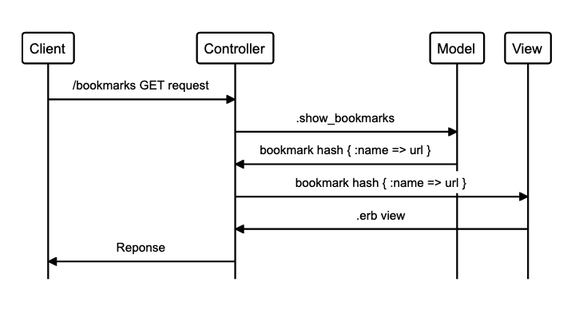

## USER STORIES

```
As a user
So that I can see what bookmarks I have
I want to see a list of bookmarks
```
### Class Diagram
_____________________________________________
                  |
      User        |       Bookmark
                  |   
      name        |       name, url { }
                  |
                  |
                  |
                  |       show_bookmarks
                  |
                  |
_____________________________________________

### Domain Model




